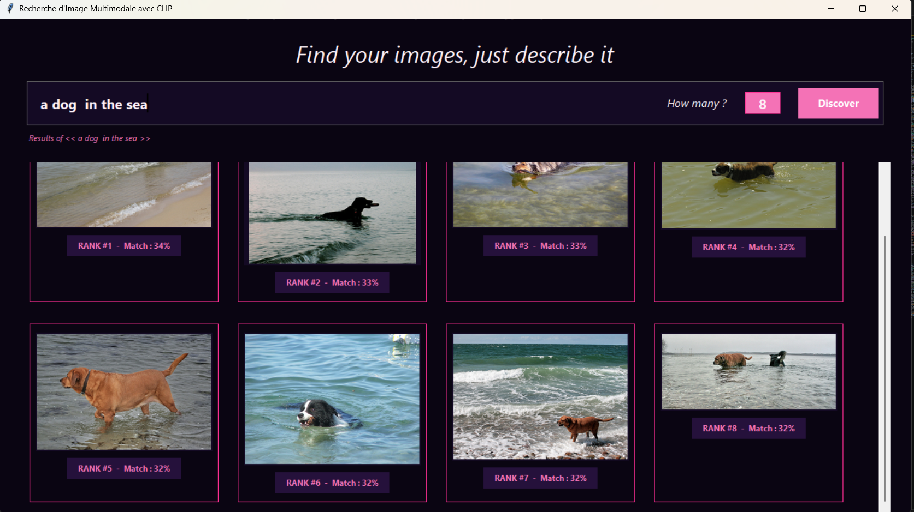

# 🔍 Moteur de Recherche Sémantique Multimodal (Image-Texte) avec CLIP

> Projet réalisé dans le cadre d'un stage de recherche de 6 semaines au **Centre Borelli (UMR 9010)** de l'Université Paris Cité.

## 📌 À propos du projet
Ce projet implémente un moteur de recherche sémantique multimodal capable de lier le texte et l'image au sein d'un même espace vectoriel. Il permet à un utilisateur :
* De rechercher des images à partir d'une description textuelle en langage naturel (texte ➔ image).
* De retrouver des images similaires à partir d'une image requête (image ➔ image).

Le système repose sur le modèle de fondation **CLIP** (*Contrastive Language-Image Pre-training*) développé par OpenAI.

## 🛠️ Technologies et Outils Utilisés
* **Langage :** Python
* **Deep Learning & Multimodal :** PyTorch, Hugging Face Transformers (Modèle `openai/clip-vit-base-patch32`)
* **Indexation et Recherche Vectorielle :** FAISS (*Facebook AI Similarity Search*) pour une recherche ultra-rapide par similarité cosinus (produit scalaire normalisé)
* **Interface Graphique :** Tkinter et Pillow (PIL) pour une application interactive en mode sombre (Dark Mode) avec gestion du multithreading
* **Jeu de données de test :** Flickr8k (8 092 images)

## 🚀 Fonctionnalités principales
1. **Extraction et indexation :** Pré-calcul des embeddings de caractéristiques (vecteurs de dimension 512) des images de la base et stockage persistant (`.pth`).
2. **Recherche instantanée :** Utilisation de l'index FAISS (`IndexFlatIP`) pour s'affranchir des boucles de calcul lentes en Python.
3. **Interface utilisateur ergonomique :** Permet de choisir dynamiquement le nombre de résultats ($k$ top-images) à afficher sous forme de grille adaptative avec les pourcentages de correspondance sémantique.

## 📄 Rapport de Stage
Le rapport de stage complet détaillant les choix mathématiques, l'analyse de complexité algorithmique, l'architecture logicielle et les perspectives d'amélioration est disponible dans le dépôt sous le nom de **`RAPPORT DE STAGE.pdf`**.

## 🖼️ Exemples de Résultats

### 1. Recherche textuelle (ex: *"a dog in the sea"*)

